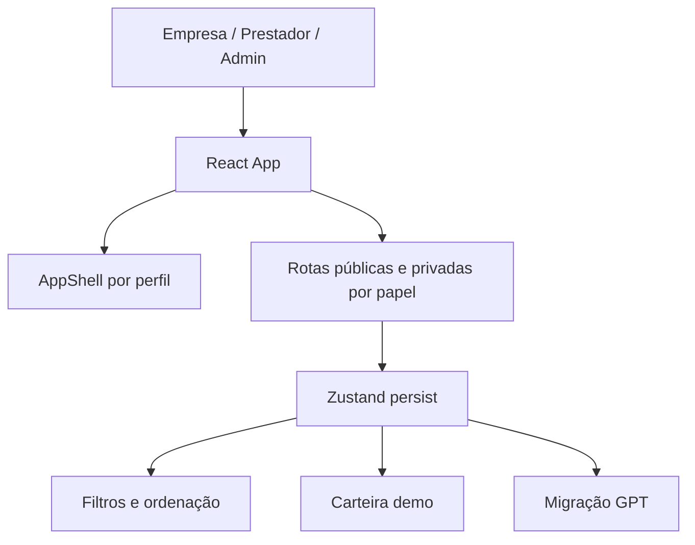

## Resumo

Bicou é um projeto React unificado, criado a partir de base Lovable e evoluído com melhorias pontuais inspiradas em protótipo GPT para o fluxo do prestador.

## Papel dentro do CapyUniverse

É um projeto de alto potencial de produto, mas seu enquadramento correto na docs precisa deixar claro que o estado atual público ainda é de protótipo funcional com fluxos demonstrativos.

## Estado atual verificado

- Landing e simulador.
- Painel empresa, painel prestador e área admin.
- Fluxos de criação de bico, confirmação de prestador e acompanhamento.
- Check-in e check-out demo.
- Carteira demo, histórico e saque simulado.
- Filtros avançados por categoria, data, valor/hora e ordenação.
- Tema claro/escuro.
- Navegação mobile por perfil.
- Migração de dados antigos no `localStorage`.
- Checklist manual de testes cobrindo fluxos principais.

## Stack verificada

- Vite + React + TypeScript.
- Tailwind CSS com tokens visuais da base Lovable.
- shadcn/ui.
- lucide-react.
- react-router-dom.
- Zustand com `persist` para estado local da demonstração.
- TanStack Query.
- Vitest.

## Arquitetura resumida



Componentes e módulos citados no README:

- `src/App.tsx`: rotas públicas, empresa, prestador e admin.
- `src/components/AppShell.tsx`: shell por perfil, sidebar desktop e bottom-nav mobile por role.
- `src/lib/store.ts`: estado persistido de bicos, favoritos, carteira demo, saques e flag de migração.
- `src/lib/bicoFilters.ts`: filtros e ordenação de bicos.
- `src/lib/legacyMigration.ts`: migração única das chaves antigas `acceptedJobs` e `jobStatuses`.
- `src/lib/wallet.ts`: seleção e cálculo de saldo, recebíveis e pagamentos.

## Como rodar

```bash
npm install
npm run dev
```

## Build e preview

```bash
npm run build
npm run preview
```

## Limitações atuais

Pagamentos, saques, contratos, validações jurídicas e integrações financeiras devem ser tratados como **simulados** até que exista implementação real e documentação de produção.

## Riscos

- Ler o protótipo como operação pronta.
- Misturar fluxo demo com fluxo transacional real.
- Riscos jurídicos e operacionais em marketplace de trabalho.
- Necessidade futura de autenticação, antifraude, pagamento, moderação e termos.

## Fontes canônicas

- [README.md](https://github.com/faelscarpato/bicou)
- [TESTE_MANUAL.md](https://github.com/faelscarpato/bicou/blob/main/TESTE_MANUAL.md)
- [package.json](https://github.com/faelscarpato/bicou/blob/main/package.json)

## INFORMAÇÃO NÃO FORNECIDA

- Demo pública oficial.
- Autenticação real.
- Integração de pagamento real.
- Termos jurídicos, reputação e política operacional verificados publicamente.
