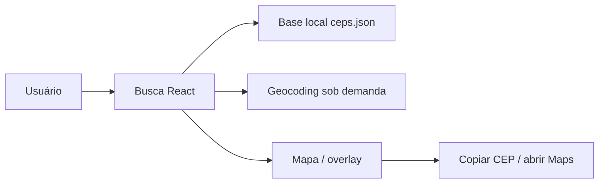

## Resumo

BuskaCEP documenta o utilitário cujo README público aparece como **Pedreira CEP**: uma aplicação web para consultar os novos CEPs de Pedreira-SP por rua, bairro ou CEP.

## Papel dentro do CapyUniverse

É um projeto de utilidade pública/local, com escopo claro e alto valor de uso imediato.

## Estado atual verificado

- Busca client-side com normalização de acentos.
- Layout responsivo com lista-first no mobile e mapa sticky no desktop.
- Mapa em overlay para o resultado ativo.
- Ações de copiar CEP e abrir no Google Maps.
- Bottom sheet mobile com preview e modo expandido.
- Geocodificação sob demanda com fallback aproximado.
- Filtros rápidos por bairros mais frequentes.
- Toast de confirmação ao copiar CEP.
- Interface única, sem dependência de Bootstrap legado ou jQuery.

## Stack verificada

- Vite.
- React.
- TypeScript.
- Tailwind CSS.
- Leaflet / react-leaflet.
- Base local em `public/ceps.json`.

## Arquitetura resumida



## Como rodar

```bash
npm install
npm run dev
```

## Como gerar produção

```bash
npm run build
```

## Estrutura principal

- `src/App.tsx`: orquestração da busca, seleção e layout principal.
- `src/components/`: bottom sheet, toast, cards de resultado e overlay do mapa.
- `src/design-tokens.css`: tokens visuais em CSS variables.
- `src/index.css`: base visual e motion global.
- `public/ceps.json`: base de CEPs.

## Limitações atuais

O geocoding usa Nominatim sob demanda e cache em memória no cliente. Para produção, o README recomenda proxy/backend com cache persistente e rate limiting, porque o serviço exige identificação adequada e limites de uso.

## Riscos

- Dependência de geocoding no cliente.
- Atualização manual da base `ceps.json`.
- Ambiguidade de naming entre **BuskaCEP** e **Pedreira CEP**.

## Fontes canônicas

- [README.md](https://github.com/faelscarpato/buskacep)
- [package.json](https://github.com/faelscarpato/buskacep/blob/main/package.json)

## INFORMAÇÃO NÃO FORNECIDA

- Processo oficial de atualização da base de CEPs.
- API própria / backend público.
- Política de cache persistente em produção.
