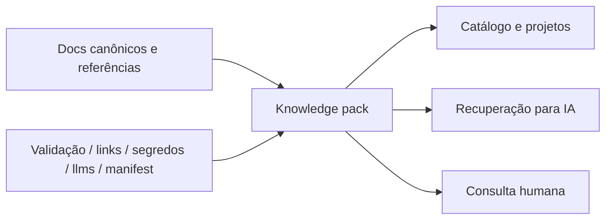

## Resumo

CapyMind é um knowledge pack docs-as-code voltado à organização navegável, versionada, segura e testável de conhecimento para IA, automações e consulta humana.

## Papel dentro do CapyUniverse

É a camada de memória, taxonomia, governança e grounding do ecossistema. Não é um app visual; é uma base operacional de conhecimento.

## Estado atual verificado

- Estrutura dedicada a documentação canônica, conhecimento derivado, instruções para agentes, contratos e governança.
- Pastas para `docs`, `ai`, `catalog`, `knowledge`, `projects`, `references`, `assets`, `schemas` e `scripts`.
- Catálogo de projetos e metadados.
- Políticas de IA, segurança e governança.
- Manifestos e índices gerados.
- Scripts públicos para validação, índice, links, segredos, `llms` e manifesto.

## Stack verificada

- Node 18+.
- TypeScript / TSX.
- AJV / JSON Schema.
- YAML.
- dotenv.
- SDK/CLI do Supabase no toolchain.

## Arquitetura resumida



## Como rodar / validar

Scripts observáveis no `package.json`:

```bash
npm run validate
npm run build:index
npm run check:links
npm run check:secrets
npm run generate:llms
npm run generate:manifest
npm run ingest
npm run chunk
npm run build
```

## Limitações atuais

O README indica uma fase de organização institucional e deixa claro que o repositório não deve ser usado como backup bruto de projetos, monorepo completo ou depósito de arquivos temporários.

## Riscos

- Virar repositório de arquivo solto em vez de knowledge pack.
- Misturar conteúdo canônico com experimental sem classificação adequada.
- Crescer sem política de revisão e sem schemas consistentes.

## Fontes canônicas

- [README.md](https://github.com/faelscarpato/capymind)
- [package.json](https://github.com/faelscarpato/capymind/blob/main/package.json)

## INFORMAÇÃO NÃO FORNECIDA

- Demo pública oficial.
- UI própria.
- Fluxo oficial de bootstrap local documentado passo a passo.
- Pipeline CI público descrito em README.
