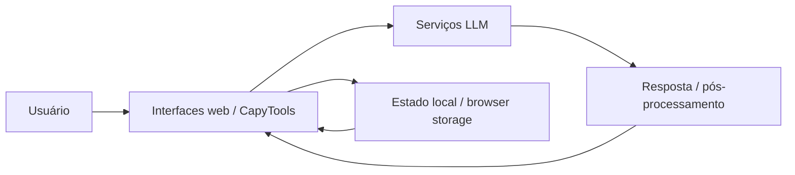

## Resumo

CapyUniverse Core é o hub experimental do ecossistema. O repositório público o descreve como uma plataforma modular de IA aplicada, voltada a ferramentas, automações e experiências web com LLMs.

## Papel dentro do CapyUniverse

É a plataforma-mãe do universo: o lugar onde os CapyTools, a camada de IA e os padrões arquiteturais se consolidam antes de se transformarem em produtos filhos ou módulos estáveis.

## Estado atual verificado

- Hub experimental, não produto único e fechado.
- Estrutura modular com múltiplas ferramentas e experimentos.
- Integração com modelos de linguagem.
- Fluxo conceitual: usuário → interface web → serviço de IA → processamento → resposta.
- Foco em arquitetura, experimentação e aprendizado.

## Stack verificada

- HTML, CSS e JavaScript.
- React e Vite.
- Gemini API e OpenAI API via HTTP.
- JSON, estado em memória e pipelines simples.
- Git, APIs REST e experimentação local.

## Arquitetura resumida



## Como rodar

```bash
npm install
npm run dev
```

O README orienta configurar variáveis de ambiente usando `.env.example`.

## Limitações atuais

- Natureza experimental e modular.
- Ferramentas podem surgir, evoluir ou ser descartadas.
- Nem todas as ferramentas estão sempre ativas.
- O foco atual está mais em arquitetura e experimentação do que em empacotamento de produto final.

## Riscos

- Escopo amplo demais para uma narrativa simples de produto.
- Risco de virar coleção de páginas soltas se não houver padrão de módulo.
- Onboarding difícil se a documentação não separar Core, agentes e projetos filhos.

## Fontes canônicas

- [README.md](https://github.com/faelscarpato/capyuniverse)
- [ARCHITECTURE.md](https://github.com/faelscarpato/capyuniverse/blob/main/ARCHITECTURE.md)

## INFORMAÇÃO NÃO FORNECIDA

- Releases publicadas.
- Suite de testes verificável no repositório de forma explícita.
- Política formal de versionamento dos CapyTools.
