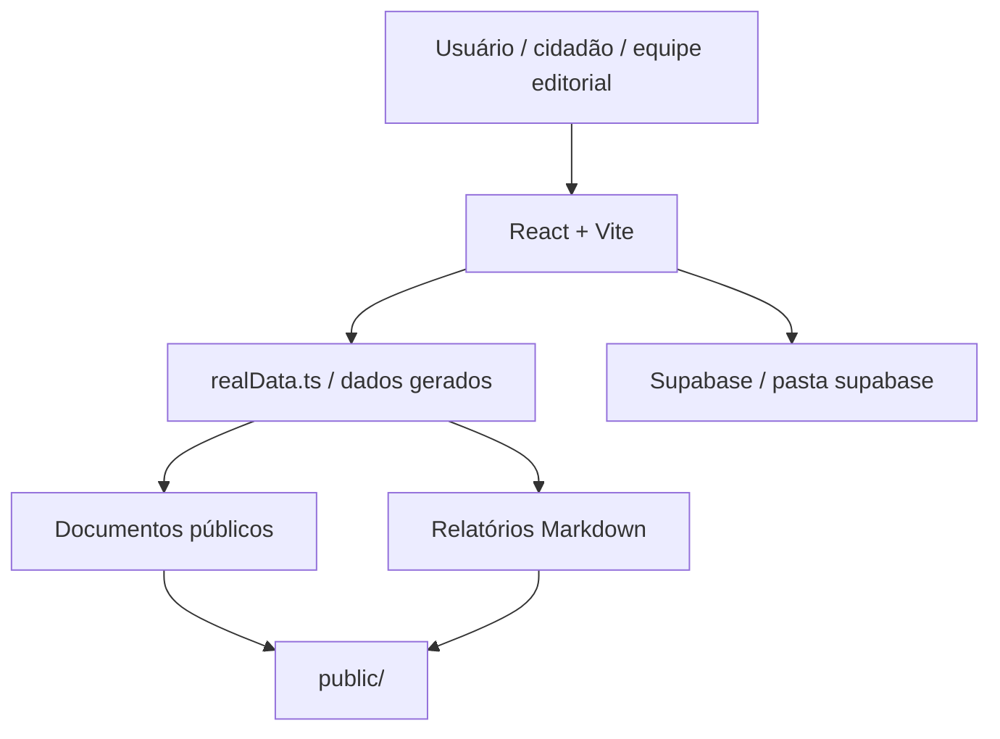

## Resumo

Sentinela Pedreira é uma plataforma pública de inteligência cívica municipal que organiza, analisa e disponibiliza documentos públicos de forma acessível e estruturada.

## Papel dentro do CapyUniverse

É o projeto filho tecnicamente mais sofisticado e um candidato forte a case de plataforma aplicada a problema real.

## Estado atual verificado

- Frontend em React + TypeScript + Vite.
- Roteamento com `react-router`.
- Estilo com Tailwind/CSS utilitário.
- Markdown renderizado com `react-markdown` + `remark-gfm`.
- Páginas da aplicação em `src/app/pages`.
- Componentes reutilizáveis em `src/app/components`.
- Camada central de agregação e normalização dos dados em `src/app/data/realData.ts`.
- Dados gerados em `src/app/data/generated/*`.
- Ativos estáticos, documentos e relatórios `.md` em `public/`.
- Fluxo atual de documentos e análises com lista montada na UI e relatórios em Markdown.
- Pasta pública de documentos da Câmara Municipal 2026 com subpastas de análises detectadas.

## Stack verificada

- React.
- Vite.
- TypeScript.
- `react-router`.
- Tailwind/CSS utilitário.
- `react-markdown`.
- `remark-gfm`.
- Supabase aparece no repositório por pasta `supabase` e nos arquivos de setup/arquitetura.

## Arquitetura resumida

## Como rodar

O repositório informa o uso de React + TypeScript + Vite e possui `package.json`. Para setup operacional completo, priorize os arquivos:

- `README_SETUP.md`
- `README_ARCHITECTURE.md`
- `package.json`

## Limitações atuais

- A documentação pública do repositório aparece em formato de `Agent.md`, não como README comercial para usuário final.
- Nem todos os tipos documentais da Câmara têm análise local `.md` no estado observado.
- Parte da documentação técnica depende dos arquivos de arquitetura e setup, não apenas do README principal.

## Riscos

- Complexidade operacional maior que os outros projetos filhos.
- Superfície maior de segurança por lidar com documentos, dados e integrações.
- Drift entre documentos gerados, dados públicos e UI se não houver pipeline claro de atualização.
- Necessidade de cuidado editorial para separar fato público, análise e opinião.

## Fontes canônicas

- [README.md](https://github.com/faelscarpato/sentinelapedreira)
- [README_ARCHITECTURE.md](https://github.com/faelscarpato/sentinelapedreira/blob/main/README_ARCHITECTURE.md)
- [README_SETUP.md](https://github.com/faelscarpato/sentinelapedreira/blob/main/README_SETUP.md)
- [package.json](https://github.com/faelscarpato/sentinelapedreira/blob/main/package.json)

## INFORMAÇÃO NÃO FORNECIDA

- Demo pública oficial.
- URL pública do projeto deployado.
- Política pública de curadoria editorial.
- Documento final de apresentação do produto para usuário não técnico.
