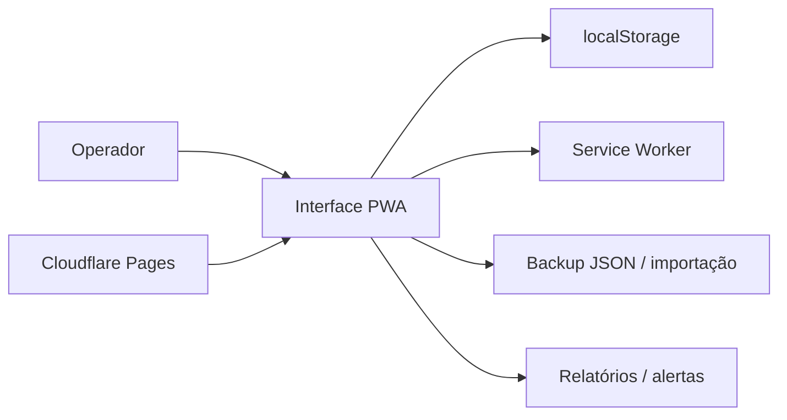

## Resumo

ValeRepor é um sistema PWA/offline para controle de validade e reposição de produtos em supermercados.

## Papel dentro do CapyUniverse

É um dos projetos com melhor aderência comercial imediata porque resolve uma dor concreta, operacional e fácil de demonstrar: validade, reposição e rotina de loja.

## Estado atual verificado

- Nome comercial ajustado para ValeRepor.
- Alerta padrão de 30 dias antes do vencimento.
- Cadastro e edição de produtos.
- Cadastro e edição de setores/prateleiras.
- Cadastro de reposição com campo de lote.
- Edição de reposições pela tela de alertas.
- Validações de quantidade, datas obrigatórias e validade anterior à reposição.
- Bloqueio de exclusão de produtos/locais com reposições vinculadas.
- Histórico de ações quando o status muda.
- Relatório com lote, histórico de ações, totais por status e setor.
- Backup JSON, importação de backup, limpeza local e dados de exemplo.
- Ícones PWA e service worker com cache básico para funcionamento offline após primeiro carregamento.

## Stack verificada

- React.
- Vite.
- TypeScript.
- Tailwind CSS.
- PWA / service worker.
- LocalStorage.

## Arquitetura resumida



## Como rodar

```bash
npm install
npm run dev
```

## Como gerar build

```bash
npm run build
```

## Limitações atuais

Os dados continuam salvos no dispositivo via `localStorage`. Para uso comercial real, o README recomenda reforçar com backup frequente ou evoluir para backend/banco de dados com login e sincronização.

## Riscos

- Perda de dados por depender do dispositivo.
- Ausência de sincronização entre operadores.
- Escalabilidade limitada sem backend multiunidade.
- Necessidade de política operacional de backup antes de uso comercial contínuo.

## Fontes canônicas

- [README.md](https://github.com/faelscarpato/valerepor)
- [CLOUDFLARE_PAGES.md](https://github.com/faelscarpato/valerepor/blob/main/CLOUDFLARE_PAGES.md)
- [package.json](https://github.com/faelscarpato/valerepor/blob/main/package.json)

## INFORMAÇÃO NÃO FORNECIDA

- Demo pública oficial.
- Arquitetura de backend.
- Autenticação real.
- Banco de dados remoto.
- Testes automatizados além da validação por build.
